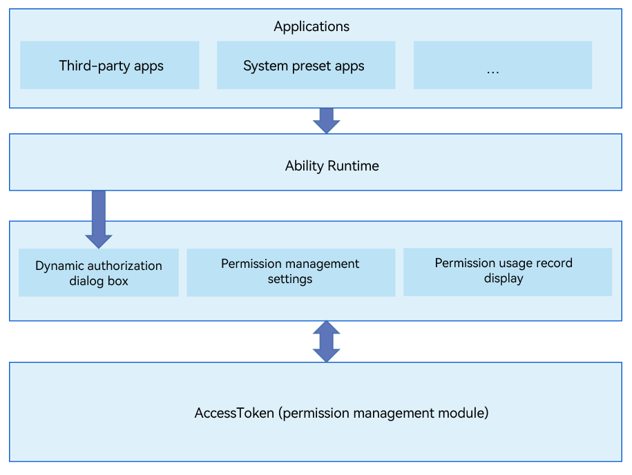

# PermissionManager


## Introduction

PermissionManager, a system application preset in OpenHarmony, provides permission dialog boxes, permission management settings, and permission usage records during the running of apps.

The following figure shows the architecture of the PermissionManager application.

## Directory Structure

```
/applications/standard/permission_manager
├── entry                              # Directory of the entry module
├── permissionmanager                  # Directory of the PermissionManager module
│   ├── src/main/ets                   # ets module
│   │       ├── Application            # abilitystage directory
│   │       ├── MainAbility            # Permission management ability
│   │       ├── ServiceExtAbility      # serviceExtension configuration
│   │       ├── common                 # Common utilities
│   │       └── pages                  # Pages
│   ├──  resources                     # Global resource files
│   └──  module.json5                  # Global configuration file
├── signature                          # Certificate files
└── LICENSE                            # License file
```

### How to Use

For details, see [Permission Application Guide](https://gitee.com/openharmony/docs/blob/master/en/application-dev/security/accesstoken-guidelines.md).

## Repositories Involved

**[security\_access\_token](https://gitee.com/openharmony/security_access_token)**
